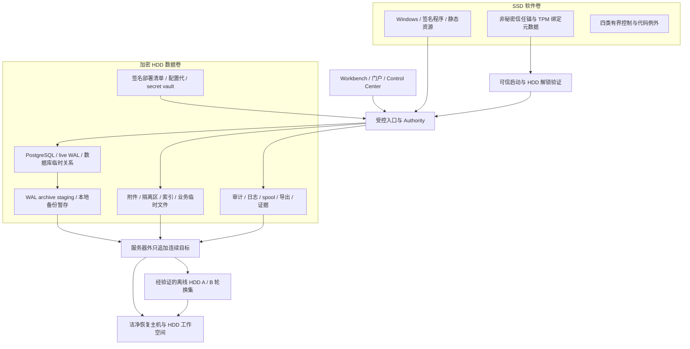

# Windows Server 与 SSD/HDD 开发交接指南

> 日期：2026-09-07（Australia/Melbourne）
> 文件分类：`CURRENT_SUMMARY_NON_NORMATIVE`。本文把现行设计、配置和五文件计划串成开发导航，不新增配置键、任务、验收门或第六份执行计划。
> 当前可从 G0 开始开发；F-57 Windows 安装器、受信存储路由和发布认证仍为 `NOT_IMPLEMENTED`，生产状态仍为 `PRODUCTION_NOT_READY`。

本文的用途是让开发者明确程序在哪里运行、哪些字节必须落在 HDD、配置由谁生成、失败时谁关闭写入，以及应到哪项现行任务实现和验证。
文档冲突按[总体设计 §1.1](superpowers/specs/2026-08-23-f57-governed-automation-fabric-design.md)处理；实际接口、任务文件和依赖以[收敛主计划](superpowers/plans/2026-08-24-f57-converged-program.md)及其四份子计划为准。
本文的目录和流程均是待实现设计投影，不能作为已部署状态或实机验证结果。

## 1. 先区分开发起点与生产准入

| 项目 | 开发起点 | 客户生产准入 |
|---|---|---|
| 硬件 | 现有 P340、i5-10500、32GB RAM、256GB SSD、1TB HDD，可用于开发和非生产验证 | 必须换装或增加合格 DATA_HDD，并绑定真实主机、磁盘、卷和容量证书 |
| 数据 | 合成、测试、可丢弃的数据 | 只有同一最终候选通过 L3，且本站点准入证据完整，才可录入真实客户数据 |
| 操作系统 | 开发机的便携测试只证明其实际覆盖范围 | 首版权威节点为原生 Windows Server 2022；Linux、WSL、Compose 不产生该平台生产证据 |
| 软件 | 现有 Rust/PostgreSQL 骨架可读、可做开发检查 | 没有现成可用的 F-57 Windows 安装器；不能把编译成功或旧脚本成功称为安装完成 |
| 1TB 原数据盘 | 保持 `production_eligible=false` | 永不作权威盘、RAID1 成员或备份盘；替换后经擦除和处置批准最多作可丢弃暂存 |
| IaaS | 仅保留未来扩展标识 | 当前选择 `IAAS_WINDOWS_SERVER_HDD_STRICT` 必须失败关闭，不能复用 P340 证据 |

生产候选 DATA_HDD 必须为 CMR，物理原始容量至少 `2,000,000,000,000` bytes；NTFS 卷容量还需满足动态公式，不能只检查包装上的“2TB”。
来源：[Windows/P340 档案 §1–4、§9.1、§15–16](superpowers/specs/2026-08-23-f57-windows-p340-production-profile.md)。

## 2. SSD 执行，HDD 保存客户数据

`software_root` 与 `data_root` 由签名部署清单绑定稳定卷/设备身份。
盘符可以帮助人定位；程序必须检查实际打开后的最终句柄、volume GUID 和物理设备，并拒绝 junction、reparse、符号链接和检查后改向。



图中备份箭头只表示逻辑保护链；完整备份集合、独立签名、身份隔离及恢复 cut 由备份契约定义，不能仅复制画出的目录。
程序位于 SSD 可改善系统和程序加载，但数据库 commit、随机查询和 WAL 持久化仍受 HDD 限制；20 人目标必须实测，不能把 SSD 的性能视为数据库吞吐保证。
SSD 上可重建的静态代码缓存必须属于已签名允许集；搜索索引、客户配置包、业务缓存、浏览器 profile、日志、导出和所有可关联客户的衍生数据仍在 HDD。
SSD 唯一 mutable Set B 为 POWER capsule、package-recovery continuation capsule、kernel pointer/journal head、signed native-code slot/cache；它们各有独立大小、保留、镜像和丢盘重建契约，不能借此新增业务缓存。

以下路径相对 `data_root`，完整顶层集合仍以[配置参考的不可覆盖部署清单](config-reference.md#f-57-不可覆盖的部署清单)为准：

| 数据用途 | 路径投影 | 实现时要防止的误用 |
|---|---|---|
| 数据库与 live WAL | `postgres/data`，live WAL 在其 `pg_wal` 子树 | 不得把 `postgres/wal` 当 live WAL；不得使用 `initdb --waldir` 或用户 tablespace 改向 |
| 已归档 WAL 暂存 | `postgres/wal` | 本机 staging 不算独立备份 |
| PG 进程与恢复临时数据 | `postgres/temp/process`、`postgres/temp/restore` | 两者分离；数据库临时关系仍属于 PGDATA |
| 附件、业务临时件、导出 | `files`、`temp`、`exports`、`working`、`generated` | 加密、分配容量类并按对象期限清理；不得回落系统 TEMP |
| 搜索与插件工作区 | `indexes`、`plugin-work` | 可重建不等于允许写 SSD |
| 客户配置与密钥密文 | `packages`、`generations`、`secrets` | 明文密钥不落盘；软件目录和 Windows 凭据库不承接客户秘密 |
| 审计、日志与证据 | `audit`、`logs`、`evidence`、`release`、`system-telemetry` | PG 日志专属 `logs/postgresql`；Windows Event Log 只放固定码与不可关联的随机 incident ID |
| writer 报文 spool | `spool/archive-writer`、`spool/backup-writer` | 各默认 256 MiB、允许 64 MiB–2 GiB；两类独立计费 |
| MCP completion spool | `spool/mcp-audit-completion/core`、`spool/mcp-audit-completion/worker` | 各固定 1 GiB；不可由通用 `spool.*` 放大 |
| 扫描隔离与备份暂存 | `quarantine`、`backup-staging` | 扫描失败保持隔离；本地备份暂存固定计入其 24 GiB 桶 |
| 保留产品诊断槽 | `dumps` | 当前不授权采集；不允许开启 Windows 六类禁用文件 |

完整归类及九桶/十四容量类/十四 selector 来源：[Windows/P340 档案 §4、§9.1](superpowers/specs/2026-08-23-f57-windows-p340-production-profile.md#91-空间公式)。

## 3. 配置从哪里来

| 来源 | 当前代码的实际能力 | F-57 生产目标 |
|---|---|---|
| 默认值、主 TOML、片段目录 | 已有通用加载器，缺失默认主配置可按空层处理 | 不能成为生产的第二份可变配置源或缺值回退 |
| `EP__*` 与配置覆盖 CLI | 开发/测试五层模型允许覆盖 | 每一个 `EP__*` 和会覆盖配置值的 CLI 参数均拒绝；只读 help/version/validation 不属于覆盖 |
| 部署清单 | 现有 loader 不提供已验证的存储根类型 | 验证签名、撤销、revision、防回滚、卷身份与路径，再派生软件/数据/备份和平台绑定 |
| active configuration generation | 尚未交付 F-57 激活证据链 | 从 CapabilityGraph 生成投影，经签名、应用读回与 participant ACK 成为当前有效代 |
| 生产只读自检 | 普通配置解析成功不能证明 HDD 路由 | 同一代的 manifest、最终句柄、容量类、服务身份与实时读回必须相互匹配 |

现存位置：[配置加载入口](../crates/platform/runtime/src/config/mod.rs)、[五层加载器](../crates/platform/runtime/src/config/loader.rs)、[旧配置分段](../crates/platform/runtime/src/config/sections.rs)。
其中仍有 `/etc/ep`、`/var/lib/ep/secrets` 和 `/var/lib/ep/spool` 等旧开发默认；[archive-writer](../apps/archive-writer/src/config.rs) 与 [backup-writer](../apps/backup-writer/src/config.rs) 的 Windows 默认也仍含旧 spool 路径。
它们是待替换输入，不能直接改成某个 `D:` 字符串就宣称生产合规。
当前 Windows 命名管道安全身份边界尚未实现，传输层固定失败关闭，见[配置参考 §2.2](config-reference.md#22-ipc)。

开发交接时应先登记配置语义、生成 owner 和生效方式，再写实现；本文不提供可执行的假生产 TOML，也不新增所谓 `storage.mode` 开关。
正式加载规则来源：[配置参考 §1](config-reference.md#1-加载顺序与总则)；signed generation 落地归 G1-05，部署/存储根验证归 G1-01。

## 4. 32GB 主机的资源与连接投影

当前 P340 认证固定无本地模型、重报表后台并发为 1、队列有界。
资源保障依次为 PostgreSQL commit/WAL/恢复、身份授权审计、增量备份、普通交互、自动化、provider 工作、批量与维护；HDD 延迟升高时先暂停低优先级工作并保存耐久 checkpoint。
20 名活跃业务用户是 `15 Workbench + 3 客户门户 + 2 供应商门户` 聚合负载，另有 1 个独立保留资源的 Control Center 会话；20 不是硬登录上限。

Windows 持久文件政策的八行中，pagefile、swapfile、hibernation、kernel/full crash dump、minidump、WER LocalDumps 六类均为 `DISABLED`；VSS diff area 和产品 quarantine 两类只可位于已验证 HDD。
DATA_HDD 在可信启动后解锁，不能依赖它承接启动 pagefile；安装后的设置和重启后实际文件必须同时验证。

| 无页文件认证指标 | 冻结门限 |
|---|---:|
| physical RAM | 32 GiB = `34,359,738,368` bytes |
| system commit limit | 至少 30 GiB = `32,212,254,720` bytes |
| 峰值及每个样本 committed bytes | 至多 24 GiB = `25,769,803,776` bytes |
| working set | 至多 16 GiB = `17,179,869,184` bytes |
| 完整混合负载 | 72 小时；无 commit 分配失败、OOM、SCM restart 或 hard-fault counter reset |

这些是全机认证阈值，不是给单个 Rust 进程或数据库分配的内存预算；不能把旧 64GiB Linux cgroup 百分比搬来使用。
唯一 typed 门限在[主计划 §3 的 WindowsPersistentFilePolicyReadbackV1 与 P340 约束](superpowers/plans/2026-08-24-f57-converged-program.md#3-stable-program-interfaces)，执行归 G6-13/G6-15。

现有四池的准确投影如下，仅用于当前开发骨架的冻结校验及后续测量种子：

| 消费者 | 池 | 常驻上限 |
|---|---|---:|
| core-server | rw | 20 |
| core-server | ro | 10 |
| job-worker | worker | 5 |
| ops-agent | ops | 2 |
| 合计 | 四个全机池，不是每进程各开四池 | 37 |

当前临时预算 10，加应用内安全储备 5，形成 `37 + 10 + 5 = 52` 峰值；有真实签名预算替代前，相关进程必须逐项接受这组值，漂移拒启。
PostgreSQL 的 `max_connections=64`、`reserved_connections=4`、`superuser_reserved_connections=3` 留出 `64−4−3=57` 个普通槽；旧应用峰值 52 后剩余的 5 个服务端普通槽，与峰值内的应用安全储备 5 分账。
未来 F-57 按完整消费者集合分别证明 `N+2<=57`、`R<=4`、`N+R+2<=61`、`S<=3`、`N+R+S+2<=64`；此处不可分配的 2 槽是独立生产 graph 契约，不能和旧种子的 5 槽相互替换。
来源：[ADR-0019](adr/ADR-0019-f57-runtime-topology-and-measured-connection-budget.md)、[配置参考 §2.3–2.4](config-reference.md#23-数据库连接)、[Windows/P340 档案 §6](superpowers/specs/2026-08-23-f57-windows-p340-production-profile.md#6-windows-服务与信任边界)。

## 5. 启动和故障如何处理

正常启动依次验证 SSD 签名程序及九个非秘密 pre-HDD locator、trusted boot/PCR/TPM，调用独立 HDD unlock broker 并读回目标卷，再读 HDD 部署清单、验证存储/配置/防回滚和 trusted time、解开 vault，按 PostgreSQL 安装契约启动并连接数据库，最后比对数据库镜像、运行拓扑和当前配置代。
HDD 未解锁、manifest 或 secret 缺失、卷替换、签名或防回滚失败时，数据库连接次数必须为零；SCM 依赖只保证启动顺序，不证明 ready。
来源：[Windows/P340 档案 §5–6](superpowers/specs/2026-08-23-f57-windows-p340-production-profile.md#5-秘密和密钥)。

| 触发条件 | 必须形成的行为 | 关键验证与任务 owner |
|---|---|---|
| 启动时 HDD 缺失、锁定、身份或路径错配 | 保持 admission closed，不连接数据库，不写 SSD fallback | 零 DB connect、final-handle/anti-rollback 负例；G1-01 |
| 运行时 HDD 掉盘、审计或 WAL 无法写入 | 全局关闭权威写，保留可用恢复证据；不能把业务切到 SSD | 断盘、写入失败与无 fallback 负例；G1-06、G6-13 |
| HDD 低于有效 yellow free 门 | 停止新大型导入、导出、报表和非必要索引重建 | `max(yellow_free,100 GiB)`；G1-06、G6-13 |
| HDD 低于有效 red free 门 | deployment-wide hold，按契约完成必要在途安全处理与受控停机 | `max(red_free,100 GiB)`；G1-06、G6-13 |
| 归档故障 WAL 达 300 GiB，或 live WAL 总量达 650 GiB | 全局 hold 并受控停机；350/700 GiB 是不可越过的终值 | 最多 30 秒采样，峰值 WAL 率 ×（采样+最坏停机时间）小于 50 GiB；G6-13 |
| 容量类缺失、重复、跨桶或未分类 allocation 非零 | 拒绝新写并全局 hold；不借其他桶，不把未知文件算元数据 | 九桶/十四类/十四 selector、整卷 allocation 分解；G1-01、G1-06、G6-13 |
| UPS 状态超过 15 秒未更新 | 立即全局 hold；首次失鲜起唯一 60 秒恢复窗，不能重置 | 同身份两次连续 fresh PASS 才能 CAS 撤销，否则本地 checkpoint/停库/关机；G6-13 |
| 连续备份目标失联、只追加约束失效或空间不足 | 不显示绿色；保留已完成/已 pin 对象，暂停低优先级工作并按保护窗升级 | 删除/覆盖/ACL/保留负探针、quota/readback；G6-11 |
| 附件扫描 unknown、timeout 或不可用 | 文件保持 quarantine，业务对象不得引用为已发布附件 | 实际 bytes digest、scanner identity/definition、扫描后重开；G2-01 |
| 发现勒索、SSD 损坏或 DATA_HDD 死盘 | 隔离旧权威，在洁净硬件恢复；重新绑定身份、epoch/generation 并复验 | off-host checkpoint/cut、独立恢复材料、PITR/附件一致性；G6-12/G6-15 |
| 恢复完成但备份拓扑仍在 bootstrap，或当前证据不匹配 | 继续关闭生产，不能以数据库能启动代替全部准入证据 | fresh HEALTHY、A/B closure、same-candidate L3 和站点证据；G6-11/G6-15 |

容量资格必须同时检查 physical raw、NTFS total 和元数据分解。九桶合计 `1,481,763,717,120` bytes（1380 GiB），另有不可借用 100 GiB：

```text
volume_total_bytes >= max(
  1,589,137,899,520,
  1,481,763,717,120 + 107,374,182,400
  + measured_unclassifiable_filesystem_allocation_bytes
)
```

运算使用 checked `u128`；measured 项只能是实测 NTFS/BitLocker 卷元数据，未知普通文件计入独立异常并失败。
水位及故障行为来源：[Windows/P340 档案 §9–12](superpowers/specs/2026-08-23-f57-windows-p340-production-profile.md#9-容量和磁盘安全线)。

## 6. 按既有任务实现和验收

下面是主题到既有 owner 的导航；依赖顺序仍按[主计划 §5 DAG](superpowers/plans/2026-08-24-f57-converged-program.md#5-dependency-dag)，不能凭本表跳过 G0、业务主干或集成门。

| 主题 | 唯一任务入口 | 开发应交付的可验证结果 |
|---|---|---|
| 开始 G0、固定范围与工具入口 | [G0-01 / Task 1](superpowers/plans/2026-08-24-f57-g0-bootstrap-implementation.md#task-1-freeze-the-185-row-delivery-registry-and-f57-cli) | 185 行登记、任务 staging 和 F57 CLI；该 CLI 由此任务创建，今天不应假定可运行 |
| 配置、容量和接口投影 | [G0-02–05](superpowers/plans/2026-08-24-f57-g0-bootstrap-implementation.md#task-2-build-and-import-the-single-capabilitygraph) | 单一 CapabilityGraph、可重生成配置/容量投影、共享签名和拓扑契约；fixture 成功不产生生产激活授权 |
| 可信存储与秘密启动 | [G1-01](superpowers/plans/2026-08-24-f57-authority-spine-implementation.md#task-g1-01-establish-deployment-hdd-storage-trusted-time-and-secret-recovery-boundaries) | 私有已验证 HDD root、manifest 防回滚、secret broker、零 DB connect 负例 |
| 配置代与资源准入 | [G1-05–06](superpowers/plans/2026-08-24-f57-authority-spine-implementation.md#task-g1-05-persist-signed-generation-activation-participant-ack-and-artifact-pins) | 同代应用、ACK、durable checkpoint、全局 hold 与容量 governor |
| 文件安全入库 | [G2-01](superpowers/plans/2026-08-24-f57-authority-spine-implementation.md#task-g2-01-govern-hdd-backed-file-intake-quarantine-and-clean-evidence) | HDD quarantine、扫描后字节/句柄二次验证、不可变 clean file version |
| Windows 原生承载 | [G6-10 / Task 10](superpowers/plans/2026-08-24-f57-expansion-release-implementation.md#task-10-freeze-the-native-windows-authority-carrier-manifest-and-fencing-contract) | 原生服务静态 manifest、WiX/MSI 投影、部署接口和 fencing/读回 fixtures；不构建生产 participant，也不安装或启动服务 |
| PostgreSQL 与连续/离线备份 | [G6-11 / Task 11](superpowers/plans/2026-08-24-f57-expansion-release-implementation.md#task-11-add-and-rehearse-streaming-append-only-backup-and-offline-media) | PG16 锁定安装链、路径/ACL/TLS/连接分类、只追加备份、A/B 轮换与签名 checkpoint |
| 洁净恢复 | [G6-12 / Task 12](superpowers/plans/2026-08-24-f57-expansion-release-implementation.md#task-12-implement-ransomware-isolation-and-rehearse-clean-restore) | 勒索隔离、恢复 cut、DB/附件/审计/vault 一致性及实测恢复时间 |
| SSD/HDD、UPS、容量证据 | [G6-13 / Task 13](superpowers/plans/2026-08-24-f57-expansion-release-implementation.md#task-13-implement-current-p340-ups-hdd-routing-and-capacity-certification-harnesses) | 可运行采集器与正反例；准备完整写跟踪、八行 OS 政策和 72 小时负载 harness，实机认证在 Task 15 执行 |
| 最终发布与本站点准入 | [G6-14–15](superpowers/plans/2026-08-24-f57-expansion-release-implementation.md#task-14-commit-all-final-candidate-and-release-gate-tooling) | Task 14 交付 collector/工具；Task 15 同一候选生产签名构建、安装、动态读回、72 小时与 L3，再显式生产准入；不复用旧候选证明 |

开发者现在可按 G0-01 的文件清单和 RED/GREEN 步骤开始实现；后续命令必须等对应任务交付后使用。
当前不应执行历史 `deploy/` 生产命令，也不能把本文中的目录树当作手工安装规程。
本轮完成的是可立即开发的架构与配置交接，真实机器的安装、容量、断电和恢复结果必须由后续任务实际产生。

生产前还须取得服务器外只追加目标、至少两块独立离线轮换 HDD、独立分域的应用/备份恢复材料、UPS 与洁净恢复能力；地点和处理边界须满足现行中国大陆驻留要求。
单机单盘通过全部门后仍标识 `SINGLE_DISK_DEGRADED_PRODUCTION`，不承诺高可用、热插拔或统一四小时恢复。
